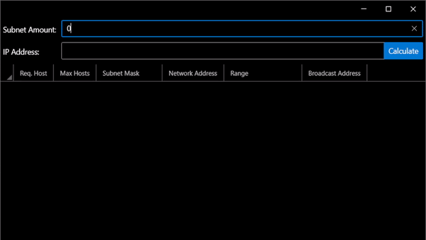
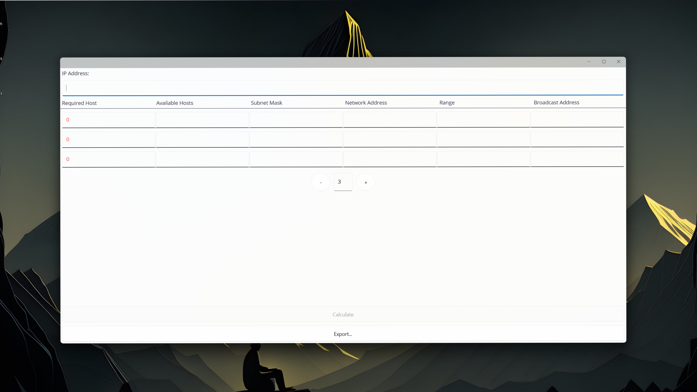
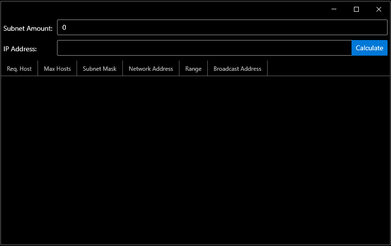
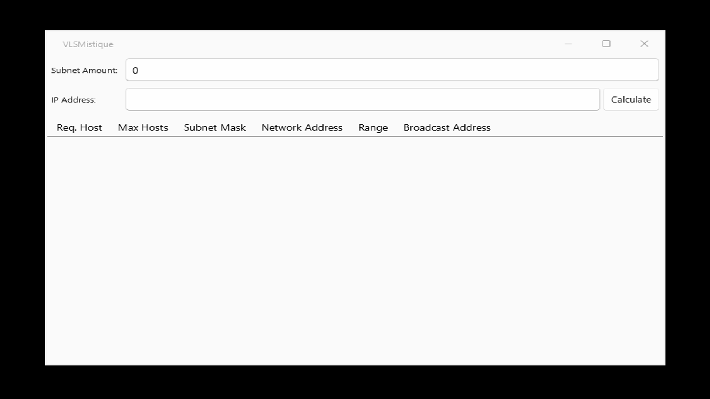
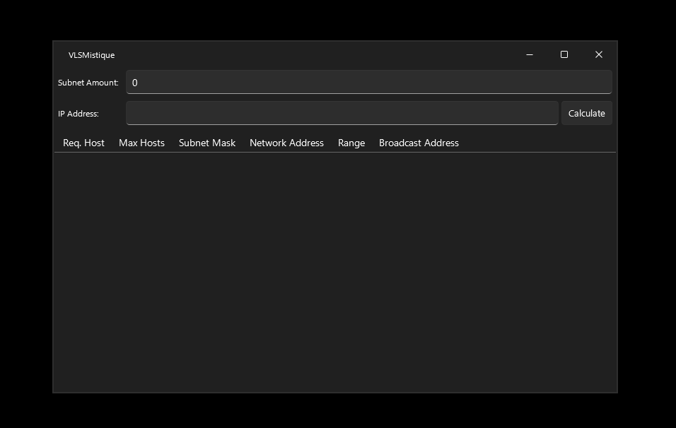

[![Contributors][contributors-shield]][contributors-url]
[![Forks][forks-shield]][forks-url]
[![Stargazers][stars-shield]][stars-url]
[![Issues][issues-shield]][issues-url]
[![Apache 2.0 License][license-shield]][license-url]
[![LinkedIn][linkedin-shield]][linkedin-url]

<!-- PROJECT LOGO -->
 

  

<h3 align="center">VLSMistique</h3>

  

    A VLSM Calculator that Calculates subnets using a given IP, the amount of subnets and hosts for each subnet.
     
     
     
    <a href="https://github.com/RespectMathias/VLSMistique">View Project</a>
    ·
    <a href="https://github.com/RespectMathias/VLSMistique/issues">Report Bug</a>
    ·
    <a href="https://github.com/RespectMathias/VLSMistique/issues">Request Feature</a>
  

<!-- TABLE OF CONTENTS -->

  
Table of Contents

  <ol>
    <li>
      <a href="#about-the-project">About The Project</a>
      <ul>
        <li><a href="#built-with">Built With</a></li>
      </ul>
    </li>
    <li>
      <a href="#getting-started">Getting Started</a>
      <ul>
        <li><a href="#prerequisites">Prerequisites</a></li>
        <li><a href="#installation">Installation</a></li>
      </ul>
    </li>
    <li><a href="#usage">Usage</a></li>
    <li><a href="#roadmap">Roadmap</a></li>
    <li><a href="#contributing">Contributing</a></li>
    <li><a href="#license">License</a></li>
    <li><a href="#contact">Contact</a></li>
    <li><a href="#acknowledgments">Acknowledgments</a></li>
  </ol>

<!-- ABOUT THE PROJECT -->
## About The Project 🌐

Tired of manually calculating subnets for your networks? Say hello to VLSMistique - a sleek and powerful Windows-based application that simplifies subnetting in a visually stunning and user-friendly interface.

1. Input the amount of **subnets** you need
2. Input the **IP-Address** you want the subnets for
3. Input the **hosts** you need for each subnet in their respective grid

(<a href="#readme-top">back to top</a>)

## Key Features 💡

* **Effortless Subnet Calculations:** Simply enter the IP address, the desired number of subnets, and the number of hosts for each subnet, and let VLSMistique work its magic!
* **Stunning User Interface:** The ModernWPF, MicaWPF, and CommunityToolkit.MVVM libraries provide a sleek and contemporary look, making subnet calculations a visually delightful experience.
* **Windows Compatibility:** Seamlessly integrates with your Windows environment for a smooth and hassle-free experience.
* **Time-Saving:** Say goodbye to manual subnet calculations and let VLSMistique save you valuable time and effort.

#### Windows 11 Mica themes

#### Windows 10 themes

(<a href="#readme-top">back to top</a>)

<!-- GETTING STARTED -->
## Getting Started 🚀
To get a local copy up and running, follow these simple steps:
1. **Clone the repo** 'git clone https://github.com/RespectMathias/VLSMistique.git'
2. **Open project in Visual Studio**
3. **Build and run the project**

### Installation
**Prerequisites:**
* [.NET 7.0 desktop runtime](https://dotnet.microsoft.com/en-us/download/dotnet/7.0)
* Windows 10 or newer

1. Download the **MSIXBundle** and **batch** from the [releases](https://github.com/RespectMathias/VLSMistique/releases/)
2. Keep them in the same folder and **run** the batch to apply certificate and install
3. And voilà!

(<a href="#readme-top">back to top</a>)

<!-- ROADMAP -->
## Roadmap 🚗

- [x] Use CommunityToolkit.MVVM for MVVM
- [x] Updating theme and icon to match windows 11
- [x] Make a MSIXBundle installer
- [ ] Add to Microsoft store
- [ ] Port to .NET MAUI
  - [ ] Add multiplatform support

See the [open issues](https://github.com/RespectMathias/VLSMistique/issues) for a full list of proposed features (and known issues).

(<a href="#readme-top">back to top</a>)

<!-- CONTRIBUTING -->
## Contributing 🤝

Contributions, issues, and feature requests are welcome! Feel free to check the [issues](https://github.com/RespectMathias/VLSMistique/issues) page. In fact i would appreciate it alot due to my lacking expertise.

(<a href="#readme-top">back to top</a>)

<!-- LICENSE -->
## License 📝

Distributed under the Apache 2.0 License. See `LICENSE.txt` for more information.

(<a href="#readme-top">back to top</a>)

<!-- NOTICE -->
## Built With 🛠️

* [ModernWPF framework](https://github.com/Kinnara/ModernWpf)
Modern styles and controls for your WPF applications.
* [MicaWPF library](https://github.com/Simnico99/MicaWPF)
This is a library to make Mica available in WPF.
* [Community Toolkit](https://github.com/CommunityToolkit/WindowsCommunityToolkit)
Provides a simplified method of implementing MVVM.

See `NOTICE.txt` for more information.

(<a href="#readme-top">back to top</a>)

<!-- CONTACT -->
## Contact 📧
If you have any questions, comments, or concerns contact me through the github page:

- LinkedIn: [@Linkedin](https://www.linkedin.com/in/mathias-lund-hansen-776800264/)
- Project Link: [https://github.com/RespectMathias/VLSMistique](https://github.com/RespectMathias/VLSMistique)

Unlock the full potential of your network management with **VLSMistique** - the premier solution for all your IP subnetting needs!

(<a href="#readme-top">back to top</a>)

<!-- MARKDOWN LINKS & IMAGES -->
[contributors-shield]: https://img.shields.io/github/contributors/RespectMathias/VLSMistique.svg?style=for-the-badge
[contributors-url]: https://github.com/RespectMathias/VLSMistique/graphs/contributors
[forks-shield]: https://img.shields.io/github/forks/RespectMathias/VLSMistique.svg?style=for-the-badge
[forks-url]: https://github.com/RespectMathias/VLSMistique/network/members
[stars-shield]: https://img.shields.io/github/stars/RespectMathias/VLSMistique.svg?style=for-the-badge
[stars-url]: https://github.com/RespectMathias/VLSMistique/stargazers
[issues-shield]: https://img.shields.io/github/issues/RespectMathias/VLSMistique.svg?style=for-the-badge
[issues-url]: https://github.com/RespectMathias/VLSMistique/issues
[license-shield]: https://img.shields.io/github/license/RespectMathias/VLSMistique.svg?style=for-the-badge
[license-url]: https://github.com/RespectMathias/VLSMistique/blob/master/LICENSE.txt
[linkedin-shield]: https://img.shields.io/badge/-LinkedIn-black.svg?style=for-the-badge&logo=linkedin&colorB=555
[linkedin-url]: https://www.linkedin.com/in/mathias-lund-hansen-776800264/
